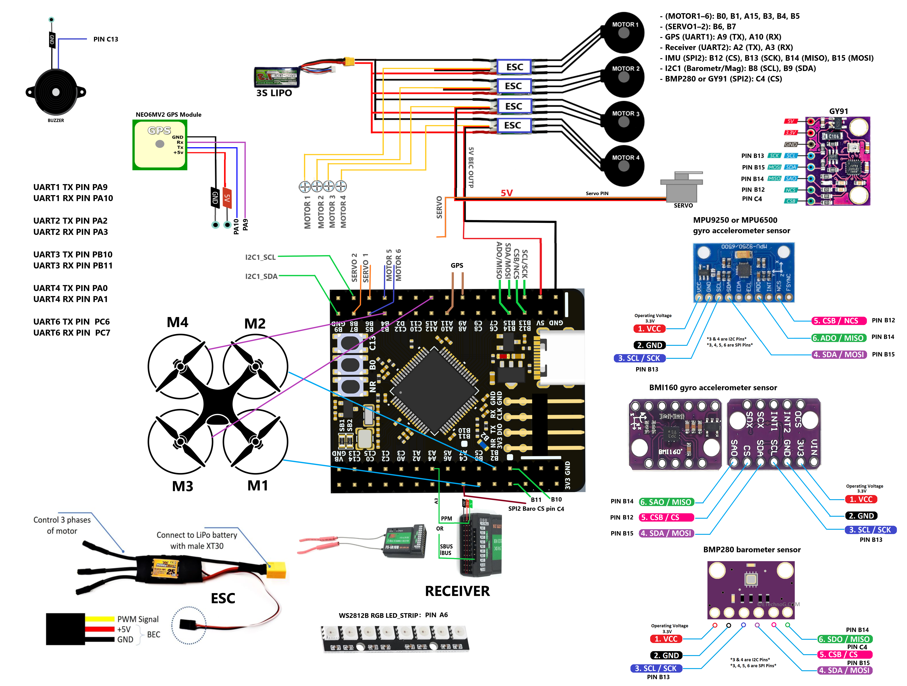
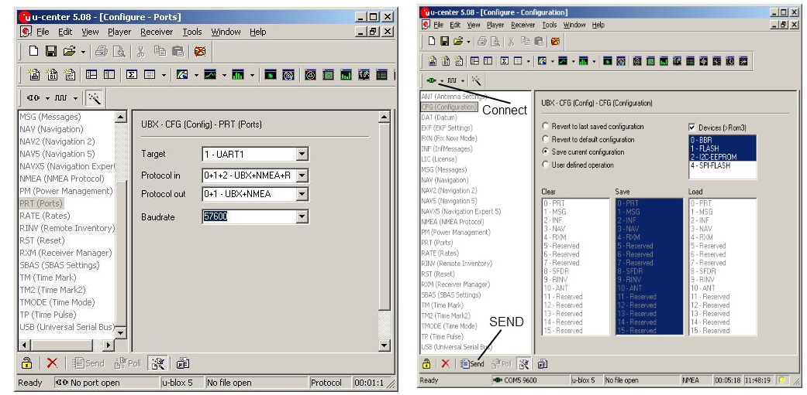

# 🛫 WeActStudio STM32F4 CoreBoard — Betaflight 4.5.2

## 📦 Hardware Overview
- **MCU**: STM32F405RGT6 (64-pin)
- **Firmware**: Betaflight 4.5.2 (custom build)
- **Board**: WeActStudio STM32F4 CoreBoard

## 🔌 Entering DFU Mode & Flashing Firmware

1. Press and hold the **BOOT0 (B0)** button on the board.
2. Connect the USB cable to your computer.
3. Release the button → the board enters **DFU mode**.
4. Open [Betaflight Configurator](https://github.com/betaflight/betaflight-configurator):
   - Navigate to the "Firmware Flasher" tab
   - Click "Load Firmware [Local]" and select your `.hex` file
   - Click "Flash Firmware" to begin flashing

## ⚙️ Pin Assignments

### 🚀 Motor Outputs
| Motor | Pin  |
|-------|------|
| M1    | B0   |
| M2    | B1   |
| M3    | A15  |
| M4    | B3   |
| M5    | B4   |
| M6    | B5   |

### 🎯 Servo Outputs
| Servo | Pin   |
|--------|------|
| S1     | B6   |
| S2     | B7   |

### 🌐 GPS (UART1)
- **TX** → PA9
- **RX** → PA10

### 📡 Receiver (UART2)
- **TX** → PA2
- **RX** → PA3

### 🧭 IMU Sensor (SPI2)
| Signal | Pin  |
|--------|------|
| CS     | B12  |
| SCK    | B13  |
| MISO   | B14  |
| MOSI   | B15  |

### 🌫️ I2C1 (Barometer & Compass)
- **SCL** → PB8  
- **SDA** → PB9

## 🧪 Notes

###⚙️ Motor and Servo Setup
- Select the flight type and ESC protocol you want to use from the Motor tab and save.
- Select which channels the servos will use from the Servo tab and save.

### ⚙️ Set up your RC receiver.
- Check that the signal cable of your receiver is connected to the **A3** pin. Test your receiver by selecting the protocol of your RC transmitter.

### ⚙️ GPS setup.
- Check that the RX pin of the GPS module is connected to the **A9** pin of the Flight Control Card and the GPS TX pin is connected to the **A10** pin of the Flight Control Card. Open the betaflight Configurator software and check that GPS is selected under the sensor heading in **UART1** from the PORT tab and that the GPS Baund value is suitable for your GPS module. Save and exit. If the GPS icon is red, this means that the GPS module has not yet received all the satellites. Wait a little, it will turn into a yellow icon when it does.

### ⚙️ My GPS module is plugged in but it doesn't see it!.
Applications like Ardupilot automatically configure the GPS module and change the GPS baud rate to **230000**. The value 230000 is not available in flight control software like Betaflight and INAV and your GPS module is not detected.

### 📦 How can I configurate the baudrate for all uBlox devices?
First you have to install the uBlox Center for your system from the following website:
 
[uBlox center](https://www.u-blox.com/en/product/u-center):
1. For connecting the GPS receiver with the ublox center press the button "Connect".
2. Press "View" and then "Configuration View". Choose the "PRT (Ports)" for the Baudrate and then klick to "SEND".
3. Choose the new Baud rate as your new connection parameters.

